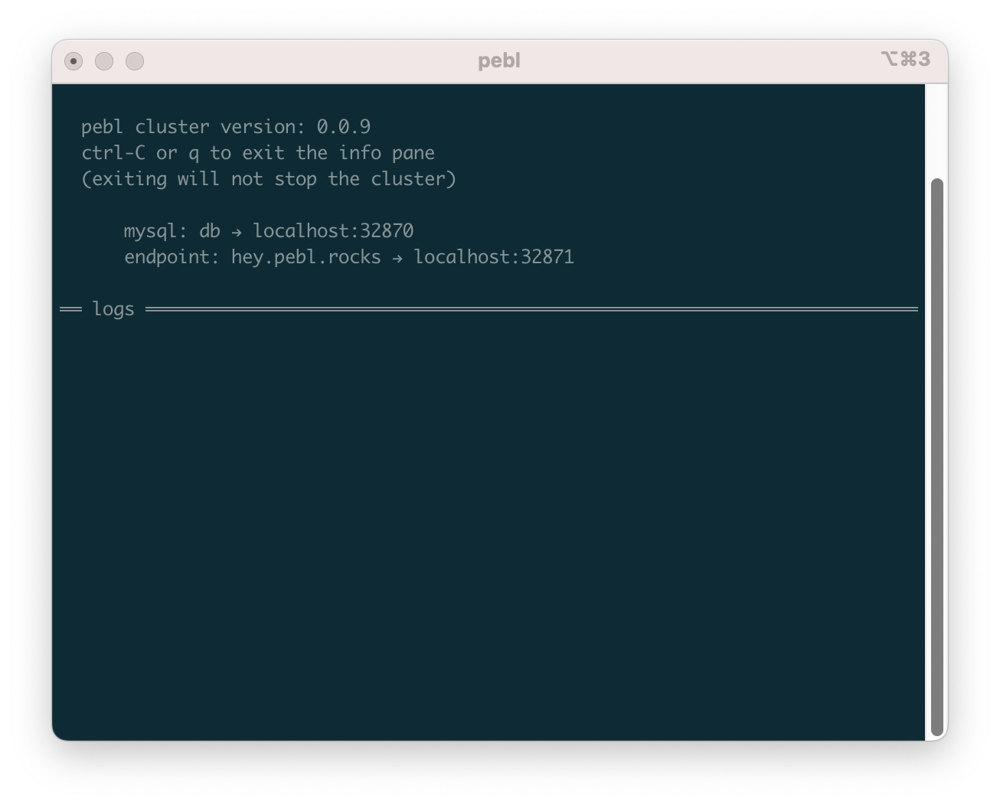

# chat

A simple [Flask application](https://flask.palletsprojects.com/en/2.3.x/) that
implements a very basic chat service.

## running

  1. ensure your local cluster is running with `pebl up`
  2. execute `pebl run` inside this folder
  3. inspect the running workloads with `pebl info`



## sending requests

The flask app is configured with two endpoints, `/` and `/create`.

The `/` endpoint returns a list of all messages, in descending order of creation
time.

The `/create` endpoint is a `POST` endpoint, used to create new messages.

```bash
$ curl localhost:32871
{"messages":[]}
$ curl -XPOST -d '{"message":"hello, world!"}' localhost:32871/create
{"message_id":1}
$ curl localhost:32871
{"messages":[{"content":"hello, world!","mid":1}]}
$
```

## extra tips

We really love the [jq](https://jqlang.github.io/jq/) tool when working with
json. If installed, you can use it to create a more human readable output.

```bash
$ curl -s localhost:32871 | jq
{
  "messages": [
    {
      "content": "hello, world!",
      "mid": 1
    }
  ]
}
$
```

## next steps

Obviously it's not very useful to have a chat without any user information.
It's also not very secure! Try adding simple user authentication, so that
requests to the `/create` endpoint take some type of authentication scheme.
